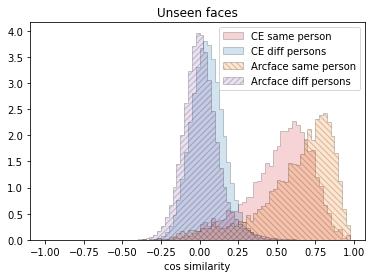
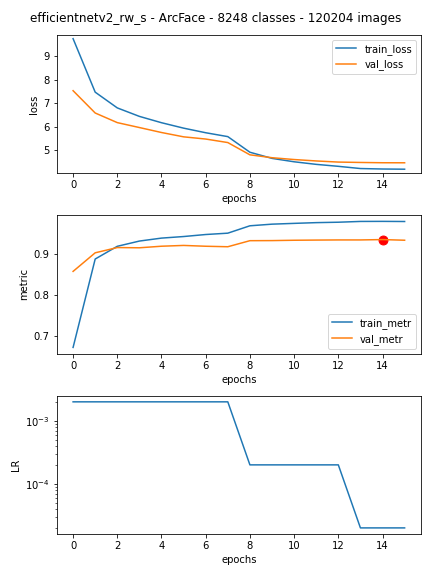

# Face recognition pipeline :camera:

## Intro :bulb:

The idea was to manually implement the entire face recognition pipeline from the beginning (face detection) to the end (implementation in the form of a telegram bot).

Third-party pre-trained universal neural networks are used:
- YOLO v5
- ImageNet CNNs

All these networks were fine-tuned.

The models weights are not included in this repo.

## Demo :iphone:

Bot receives two images:
- How I Met Your Mother cast
- Random face from https://thispersondoesnotexist.com/

For each face the bot returns 8 most similar celebrities form CelebA with cosine similarity values and color coding.

## Project structure :ledger:

The project is divided into experimental Jupiter notebooks with a detailed description of each stage:

- **Study 01 - Face Detection with YOLO**. The YOLO model was fine-tuned on the CelebA dataset to predict bboxes
- **Study 02 - Face Alignment - Landmark Coordinates Regression**. The ImageNet model was fine-tuned to predict 5 facial landmarks: eyes, nose, mouth edges
- **Study 03 - Full Dataset Face Detection and Alignment**. Found bboxes and facial landmarks for full dataset, saved to file
- **Study 04 - Face Recognition**. Trained model for face embedding with arcface loss
- **Study 05 - Step-wise Inference**. Wrapped all three models into single class, used with webcam to find similar faces
- **Study 06 - Telegram Bot Inference**. Aiogram bot with some functions and explanations
- **Telegram Bot .py file** or **Run_bot.ipynb**. Single file for starting the bot

## Dataset :books:

Dataset - [CelebA](https://mmlab.ie.cuhk.edu.hk/projects/CelebA.html).

The good:
- *relatively small (compared to MS-celeb-1M)*
- has about 10 000 people
The bad:
- some people have only 1-2 photos
- some photos are low-res
- doesn't contain names for persons
The ugly:
- doesn't have much image diversity for each person

## Methodology :ant:

**Language**: python

**Libraries**:
- pytorch
- aiogram
- cv2, PIL, albumentations
- pandas, numpy
- sklearn
- timm

**Pretrained models** (fine-tuned for the task):
- YOLOv5
- ImageNet models from timm library

**Methos**:
- YOLO for bbox detection (default parameters)
- Coordinate regression with Wing Loss for landmark detection
- Classification with Arcface Loss for embedding CNN training (label smoothing, pre-training with simple CE loss, heavy augmentations, sunglasses overlay)
- Cos similarity for finding similar faces
- Async telegram bot with wrapper for all three models

## How to improve result :moneybag:
- **get larger dataset** with more diversity. For example - MS-celeb-1M (with fixed errors)
- use more powerful models. All three used models - detection, landmark regression and recognition - are lightweight and fast. Result can be improved by using "heavier" models
- tune recognition network training hyperparameters:
    - arcface loss m and s
    - LR and scheduler
    - label smoothing (maybe add label flip?)
    - higher training resolution
    - other augmentations
    
## Some training data :wrench:

This is the resulting cosine similarity distribution for people model has not seen during the training.

Metric: TPR@FPR=0.01: 0.859, threshold 0.369

Learning curve for arcface loss.

